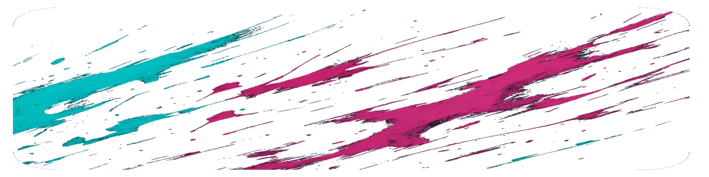

<!-- ==========================================================
⭐️  Kevin Hierro · Web · Data · DevOps · Evangelion Neon Mix
     A README that embraces color, motion & a touch of anime
========================================================== -->

<!-- 🔥 Animated Gradient Banner (pure SVG + CSS) -->

  <svg width="100%" height="170" viewBox="0 0 1200 170" preserveAspectRatio="none" xmlns="http://www.w3.org/2000/svg">
    <defs>
      <linearGradient id="grad" x1="0%" y1="50%" x2="100%" y2="50%">
        <stop offset="0%" stop-color="#3f6d4e">
          <animate attributeName="stop-color" values="#3f6d4e;#1d1a2f;#3f6d4e" dur="6s" repeatCount="indefinite" />
        </stop>
        <stop offset="100%" stop-color="#965fd4">
          <animate attributeName="stop-color" values="#965fd4;#8bd450;#965fd4" dur="6s" repeatCount="indefinite" />
        </stop>
      </linearGradient>
    </defs>
    <rect width="1200" height="170" fill="url(#grad)" />
    <text x="50%" y="57%" dominant-baseline="middle" text-anchor="middle"
          fill="#ffffff" font-size="42" font-family="'Segoe UI', sans-serif" letter-spacing="2">
      KEVIN HIERRO • WEB ✦ DATA ✦ DEVOPS
    </text>
  </svg>

<!-- 🌊 Wavy divider (static SVG) -->

  

<!-- 🚀 Offer Cards (HTML+inline CSS) -->

  

    <h2 style="margin:0 0 10px 0;">🌐 Web</h2>
    
Front‑ends accesibles y APIs robustas

    
<strong>Stack:</strong> TypeScript · React · Spring Boot · Node.js

  

  

    <h2 style="margin:0 0 10px 0;">📊 Datos</h2>
    
Pipelines reproducibles y analítica

    
<strong>Stack:</strong> Python · Spark · dbt · SQL

  

  

    <h2 style="margin:0 0 10px 0;">⚙️ DevOps</h2>
    
IaC, CI/CD & observabilidad

    
<strong>Stack:</strong> Terraform · Azure · GitHub Actions

  

<!-- 🏄‍♂️ Floating separator -->

  

<!-- 🛠️ How I Work (neon frame) -->

  <h2 style="margin-top:0;color:#8bd450;">🛠️ Cómo trabajo</h2>
  <ul style="list-style:none;padding-left:0;font-size:1.1rem;">
    <li>🚦 <strong>TDD & BDD</strong> desde el primer commit</li>
    <li>♻️ Refactor continuo hasta que el código _brille_</li>
    <li>🔍 Observabilidad y seguridad por defecto</li>
  </ul>

<!-- 💫 Repo Pins (GitHub API cards) -->

  
  

<!-- ✉️ Contact & Badges -->

  
  

<!-- 🔚 Footer counter -->

  

